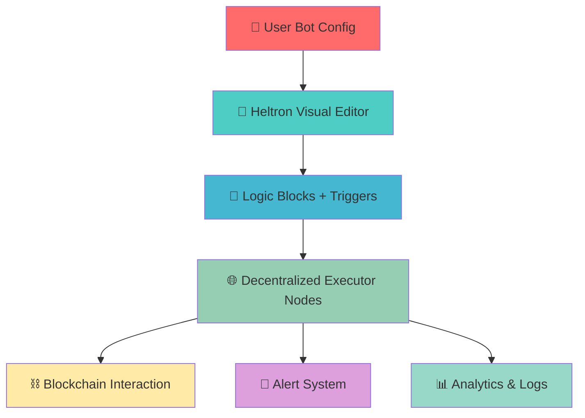

<div align="center">

# 🚀 Heltron
### *Your decentralized gateway to crypto automation*


[](https://heltron.fun)
[](https://x.com/Heltron)
[](https://github.com/Heltron)
[](https://heltron.gitbook.io/heltron-docs)


</div>

---

## 🎯 What is Heltron?

<div align="center">

</div>

**Heltron** is a revolutionary **modular decentralized automation framework** that empowers developers, DeFi users, DAOs, and NFT traders to build sophisticated bots that work 24/7 in the Web3 ecosystem.

<div align="center">

</div>

> 💡 **"Don't just watch the blockchain — make it work for you."**

---

## ⚡ Key Features

<div align="center">

| 🎨 **Visual Builder** | 🧠 **Smart Logic** | 🌐 **Decentralized** | 🔄 **Marketplace** |
|:---:|:---:|:---:|:---:|
| No-code & low-code bot creation | Visual logic blocks & triggers | Decentralized execution network | Community-built bot library |

</div>

<details>
<summary>🔥 <strong>Click to see all features</strong></summary>

```
⚙️  No-code & low-code bot builder
🧠  Visual logic blocks & triggers  
🌐  Decentralized execution framework
🔁  Marketplace of community-built bots
🛠️  Built-in automation templates
📊  Real-time dashboards & bot logs
📡  Cross-channel alerting (Telegram, Discord, email)
🔐  Key management & wallet safety tools
🎯  Multi-chain support
⚡  Lightning-fast execution
🛡️  Enterprise-grade security
📈  Advanced analytics & insights
```

</details>

---

## 🚀 Quick Start

<div align="center">

</div>

```bash
# 🔥 Get started in 3 simple steps

# 1️⃣ Clone the repository
git clone https://github.com/Heltron/heltron.git
cd heltron

# 2️⃣ Install dependencies
npm install

# 3️⃣ Launch development server
npm run dev
```

<div align="center">

🌟 **Visit** `http://localhost:3000` **to view the app locally** 🌟


</div>

---

## 🏗️ Architecture Overview

<div align="center">

</div>



<div align="center">

### 🛠️ **Built With**


</div>

---

## 🎯 Use Cases

<div align="center">

</div>

<div align="center">

| 🔍 **Market Monitoring** | 📊 **Trading Bots** | 🪂 **Airdrop Hunters** |
|:---:|:---:|:---:|
| Price, volume, liquidity alerts | Automated trading & rebalancing | Claim airdrops automatically |

| 🗳️ **DAO Governance** | 🎨 **NFT Analytics** | 🔔 **Transaction Alerts** |
|:---:|:---:|:---:|
| Automate proposal voting | Listings, floor price tracking | Real-time wallet monitoring |

</div>

---

## 📁 Repository Structure

<div align="center">

</div>

```
🏗️ heltron/
├── 🎨 frontend/         # Visual editor and user dashboard
├── ⚡ executor/         # Decentralized bot runner logic
├── 🛠️ sdk/              # Developer SDK for custom scripts
├── 💻 cli/              # CLI tools to deploy/manage bots
├── 🏪 marketplace/      # Community bot registry
├── 📜 contracts/        # Smart contracts (upcoming)
└── 📚 docs/             # Documentation (GitBook powered)
```

---

## 🧰 Developer SDK Preview

<div align="center">

</div>

```javascript
import { HeltronBot } from '@heltron/sdk';

// 🤖 Create a smart trading bot
const tradingBot = new HeltronBot({
  name: 'ETH Price Monitor',
  trigger: {
    type: 'price_above',
    symbol: 'ETH',
    threshold: 3500
  },
  actions: [
    { type: 'send_alert', channel: 'telegram' },
    { type: 'execute_trade', amount: '0.1 ETH' }
  ]
});

// 🚀 Deploy your bot
await tradingBot.deploy();

// 📊 Monitor performance
console.log(await tradingBot.getStats());
```

<div align="center">

[](https://heltron.gitbook.io/heltron-docs)

</div>

---

## 🔐 Security & Safety

<div align="center">

</div>

<div align="center">

| 🔒 **Private Key Safety** | 🎯 **Precision Control** | 🔄 **Auto Security** |
|:---:|:---:|:---:|
| Never expose private keys | Configure signing thresholds | Automatic key rotation |

</div>

> 🛡️ **You stay in control. Always.**

---

## 🌐 Run a Heltron Node

<div align="center">

</div>

### 💰 **Earn $HTRN Rewards**

```bash
# 🚀 Become a network validator
npx heltron-cli node start

# 📊 Monitor your node
npx heltron-cli node status

# 💎 Check rewards
npx heltron-cli rewards balance
```

<div align="center">

[](https://heltron.gitbook.io/heltron-docs/hosting)

</div>

---

## 🌟 Community & Support

<div align="center">

</div>

<div align="center">

[](https://heltron.fun)
[](https://x.com/Heltron)
[](https://discord.gg/heltron)
[](https://heltron.gitbook.io)

</div>

---

## 🤝 Contributing

<div align="center">

</div>

We welcome contributions from the community! Here's how you can help:

<div align="center">

| 🍴 **Fork & PR** | 🌍 **Translate** | 🧪 **Test & Report** | 💡 **Build & Share** |
|:---:|:---:|:---:|:---:|
| Submit pull requests | Help translate docs | Test & report issues | Create & share bots |

</div>

<div align="center">

[](https://github.com/Heltron/heltron/blob/main/CONTRIBUTING.md)

</div>

---

## 📊 Project Stats

<div align="center">


</div>

---

## 📄 License

<div align="center">

</div>

This project is licensed under the **MIT License** - see the [LICENSE](LICENSE) file for details.

---

<div align="center">

### 🚀 **Ready to automate your crypto strategy?**


[](https://heltron.fun)


---

<sub>Made with ❤️ by the Heltron community</sub>

</div>
